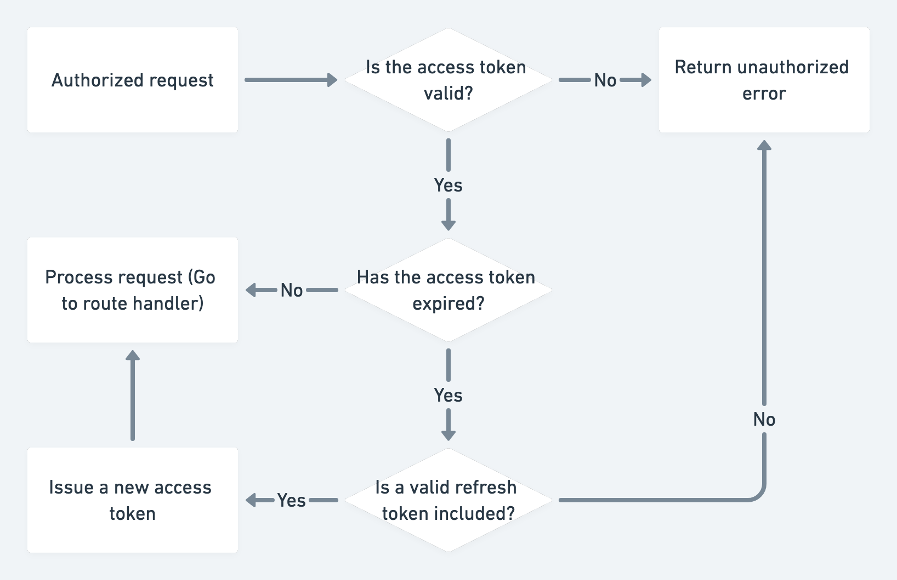
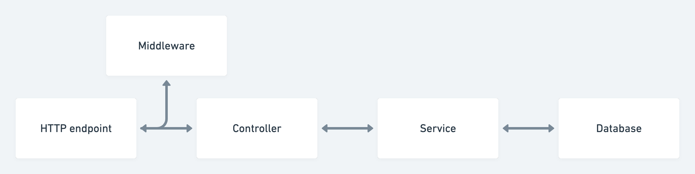

# Endurofy.app

## Overview

**Endurofy** is a versatile web application designed to help you achieve your fitness goals. This all-in-one tool allows you to seamlessly log your workout routines, and track your weight progress. Whether you’re aiming to lose weight, build muscle, or simply maintain a healthy lifestyle, Endurofy has got you covered.

### Key Features:

- **Workout Log:** Record your exercises, sets, reps, and track your progress over time.
- **Create workout program** Users can create a program and Endurofy will auto fill all the workouts for each specific day, and all you need to do is log your weights and reps that you did for each set.
- **Weight Tracking:** Easily log your daily weigh-ins and visualize your progress along sides with your calories intakes.

### Tech Stack:

- **Backend:** Node.js, TypeScript, Express.js, MySQL, AWS:RDS, EC2, JWT

## Installation

To get started with Endurofy, follow these steps:

### Clone the Repository

```sh
# Clone this repo
git clone https://github.com/LePoisson104/Endurofy_api.git
```

```sh
# Install dependencies
npm install
```

```sh
# Start the client/server
npm run start
```

\*\* folder structure

```plaintext
.
├── config/                  # Configuration files (DB connection, environment variables)
│   ├── db.ts                # MySQL database connection
│   └── cors.ts              # CORS configuration
│
├── controllers/             # Controller logic for API endpoints
│   ├── user.controller.ts    # Business logic for user-related routes
│   └── auth.controller.ts    # Business logic for authentication
│
├── models/                  # Database models and queries
│   ├── user.model.ts         # User model with SQL queries
│   └── auth.model.ts         # Auth model (e.g., JWT handling, password hashing)
│
├── routes/                  # Routes and endpoint definitions
│   ├── user.routes.ts        # Routes for user-related API endpoints
│   └── auth.routes.ts        # Routes for authentication endpoints
│
├── middlewares/             # Middlewares for validation, authentication, etc.
│   ├── rateLimiter.ts    # Middleware for authentication (JWT, etc.)
│   └── errorHandler.ts   # Middleware for handling errors
│
├── utils/                   # Utility functions (helpers)
│   └── .ts     # Helper functions for password hashing, etc.
│
├── node_modules/            # Dependencies
│
├── .env                     # Environment variables (e.g., DB credentials)
├── .gitignore               # Git ignore file
├── app.ts                   # Express app setup
├── package.json             # NPM package descriptor
└── server.ts                # Entry point to start the server
```

- Access & refresh token flow diagram
  
- Data flow diagram
  
